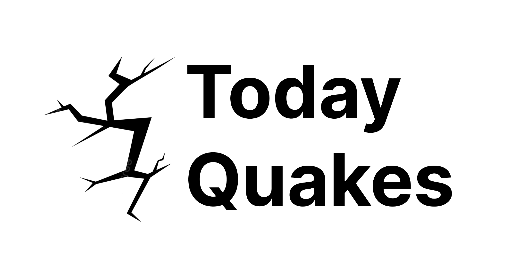
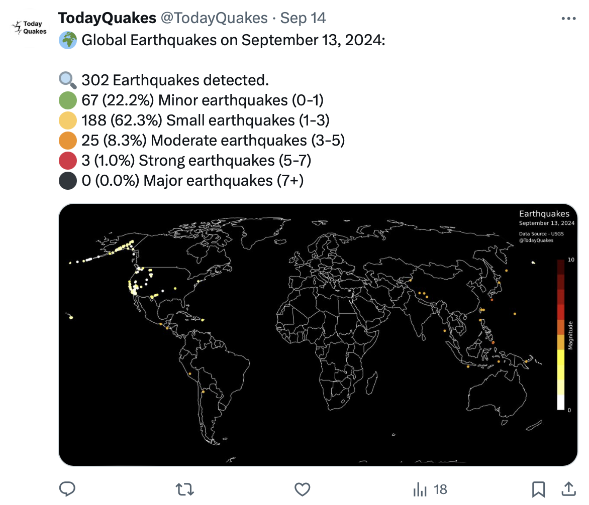

<!----------------------------------------------------------------------->

<!----------------------------------------------------------------------->

<table width="100%" style="border: none;">
  <tr>
    <!-- <td align="left" style="border: none;"><b>LE GOURRIEREC Titouan</b></td> -->
    <td align="right" style="border: none;">
      
      
      <!--  -->
    </td>
  </tr>
</table>

<!----------------------------------------------------------------------->
<!----------------------------------------------------------------------->

<!-- PROJECT LOGO -->
 

  

  

    A Twitter bot that automatically posts a daily map of the previous day's earthquakes, providing real-time global seismic activity updates.   LE GOURRIEREC Titouan 
    <!--  
    <a href="https://github.com/othneildrew/Best-README-Template"><strong>Explore the docs »</strong></a>
      -->
     
    <!-- <a href="https://github.com/othneildrew/Best-README-Template">View Demo</a>
    ·
    <a href="https://github.com/othneildrew/Best-README-Template/issues/new?labels=bug&template=bug-report---.md">Report Bug</a>
    · -->
    <a href="https://github.com/titouanlegourrierec/TodayQuakes/issues/new">Report a bug · Request Feature</a>
  

<!-- TABLE OF CONTENTS -->

  
Table of Contents

  <ol>
    <li>
      <a href="#about-the-project">About The Project</a>
      <ul>
        <li><a href="#built-with">Built With</a></li>
      </ul>
    </li>
    <li><a href="#license">License</a></li>
    <li><a href="#contact">Contact</a></li>
    <li><a href="#data">Data</a></li>
  </ol>

<!----------------------------------------------------------------------->
<!----------------------------------------------------------------------->

## About The Project

  

This project is a Twitter bot that posts daily updates on global seismic activity. Using the USGS (United States Geological Survey) [API](https://www.usgs.gov/programs/earthquake-hazards), it fetches earthquake data from the previous day, including the total number of quakes and their distribution by magnitude. The bot then generates a visual map displaying the locations of the earthquakes and posts it on Twitter (X) via the [X API](https://developer.x.com/en/products/x-api).

  

Features:
- Automatic daily data retrieval from the [USGS API](https://www.usgs.gov/programs/earthquake-hazards).
- Visual map generation of earthquakes worldwide.
- Summary of key statistics: total earthquakes and magnitude distribution.
- Automated posting on X (formerly Twitter) using the [X API](https://developer.x.com/en/products/x-api).

The main functions of the bot, including data retrieval, processing, plotting, and posting to Twitter, are defined in `DailyQuakes.py`. The automation logic is handled by `bot.py`, while logging configuration is managed by `config_logging.py`, with log messages saved to `log.txt` in the `log` directory. The daily execution of the bot is automated using GitHub Actions, with the workflow defined in `.github/workflows/bot.yml`. This setup ensures the bot runs daily without manual intervention, fetching data, generating visualizations, and posting updates seamlessly.

<!----------------------------------------------------------------------->

(<a href="#readme-top">back to top</a>)

<!----------------------------------------------------------------------->

### Built With
* [![Python][Python-badge]][Python-url]
* 
* 

<!----------------------------------------------------------------------->

(<a href="#readme-top">back to top</a>)

<!----------------------------------------------------------------------->

## License

Distributed under the MIT License. See [`LICENSE`](https://github.com/titouanlegourrierec/TodayQuakes/blob/main/LICENCE) for more information.

<!----------------------------------------------------------------------->

(<a href="#readme-top">back to top</a>)

<!----------------------------------------------------------------------->

## Contact

LE GOURRIEREC Titouan - [titouanlegourrierec@icloud.com](mailto:titouanlegourrierec@icloud.com)

Project Link: [https://github.com/titouanlegourrierec/TodayQuakes](https://github.com/titouanlegourrierec/TodayQuakes)

<!----------------------------------------------------------------------->

(<a href="#readme-top">back to top</a>)

<!----------------------------------------------------------------------->

## Data

* [USGS](https://www.usgs.gov/programs/earthquake-hazards) : Earthquakes data

<!----------------------------------------------------------------------->

(<a href="#readme-top">back to top</a>)

<!----------------------------------------------------------------------->

<!-- MARKDOWN LINKS & IMAGES -->

[Python-badge]: https://img.shields.io/badge/python-3670A0?style=for-the-badge&logo=python&logoColor=ffdd54
[Python-url]: https://www.python.org

[X-badge]: 
[X-url]: https://x.com/TodayQuakes